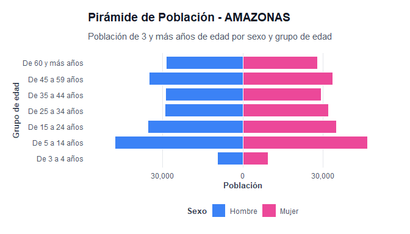

# censo2025pe

El objetivo de **`censo2025pe`** es proporcionar un acceso estructurado,
ordenado (*tidy data*) y documentado a los resultados del **Censo
Nacional 2025 de Perú** (XIII de Población, VIII de Vivienda y IV de
Comunidades Indígenas) elaborado por el Instituto Nacional de
Estadística e Informática (INEI). El paquete está diseñado bajo la
filosofía del *tidyverse* para facilitar el análisis demográfico y la
generación automática de reportes territoriales.

## Características Principales

1.  **Bases de Datos Tidy**: 9 datasets cargados de forma diferida
    (*lazy loading*) listos para su uso:
    - `censo_discapacidad`: Población con dificultades físicas o
      cognitivas.
    - `censo_educacion`: Nivel educativo alcanzado.
    - `censo_estado_civil`: Estado conyugal de la población.
    - `censo_seguro_salud`: Afiliación a seguros públicos (SIS, EsSalud)
      y privados.
    - `censo_etnicidad`: Autoidentificación étnica.
    - `censo_vivienda`: Tipo de viviendas y su condición de ocupación.
    - `censo_servicios`: Abastecimiento y procedencia de agua.
    - `censo_hogar_numero`: Cantidad de hogares por vivienda.
    - `censo_hogar_equipamiento`: Tenencia de tecnologías y bienes en el
      hogar.
2.  **Validación Geográfica**: Funciones robustas para estandarizar
    nombres de departamentos y provincias (tolerante a acentos y
    mayúsculas/minúsculas).
3.  **Visualizaciones**: Gráficos de alta calidad para pirámides
    poblacionales, educación, etnicidad y servicios.
4.  **Reportes Paramétricos**: Funciones para renderizar automáticamente
    informes detallados en HTML o PDF y realizar comparativos entre
    múltiples circunscripciones.

------------------------------------------------------------------------

## Instalación

Puedes instalar la versión de desarrollo de `censo2025pe` desde GitHub
con:

``` r

# install.packages("pak")
pak::pak("PaulESantos/censo2025pe")
```

------------------------------------------------------------------------

## Ejemplos de Uso

A continuación se muestran algunos ejemplos prácticos de cómo utilizar
las herramientas del paquete.

### 1. Búsqueda y Validación Geográfica

La función `buscar_unidad` permite verificar y estandarizar nombres
geográficos ingresados por el usuario:

``` r

library(censo2025pe)

# Buscar departamento
buscar_unidad("amazonas")
#> $matched
#> [1] TRUE
#> 
#> $tipo
#> [1] "departamento"
#> 
#> $nombre
#> [1] "AMAZONAS"
#> 
#> $departamento
#> NULL

# Buscar provincia (se toleran prefijos y minúsculas)
buscar_unidad("prov. chachapoyas")
#> $matched
#> [1] TRUE
#> 
#> $tipo
#> [1] "provincia"
#> 
#> $nombre
#> [1] "PROVINCIA CHACHAPOYAS"
#> 
#> $departamento
#> [1] "AMAZONAS"
```

### 2. Exploración de Datos

Todos los datasets están en formato largo y limpio:

``` r

library(dplyr)
#> 
#> Adjuntando el paquete: 'dplyr'
#> The following objects are masked from 'package:stats':
#> 
#>     filter, lag
#> The following objects are masked from 'package:base':
#> 
#>     intersect, setdiff, setequal, union

# Obtener población total censada por departamento (excluyendo el total nacional)
censo_educacion %>%
  filter(provincia == "Total", area == "Total", sexo == "Total", nivel_educativo == "total") %>%
  filter(departamento != "PERÚ") %>%
  group_by(departamento) %>%
  summarise(poblacion_total = sum(poblacion)) %>%
  arrange(desc(poblacion_total)) %>%
  head(5)
#> # A tibble: 5 × 2
#>   departamento       poblacion_total
#>   <chr>                        <dbl>
#> 1 LIMA METROPOLITANA         9352891
#> 2 PIURA                      2004611
#> 3 LA LIBERTAD                1917577
#> 4 AREQUIPA                   1688010
#> 5 CAJAMARCA                  1374957
```

### 3. Visualizaciones Demográficas

Puedes crear gráficos sofisticados de forma directa:

``` r

# Graficar pirámide poblacional para el departamento de Amazonas
plot_piramide_poblacion("AMAZONAS")
```



### 4. Generación de Reportes Automáticos

Puedes compilar informes ejecutivos en HTML (con estilos premium
incorporados) o PDF:

``` r

# Generar reporte individual de un departamento
generar_reporte("AMAZONAS", formato = "html")

# Generar reporte comparativo entre dos regiones
comparar_unidades(c("AMAZONAS", "AREQUIPA"), formato = "html")
```
